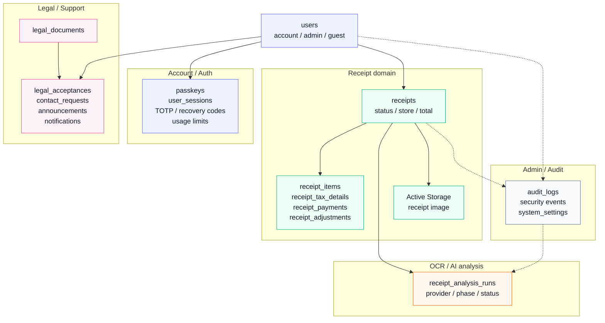
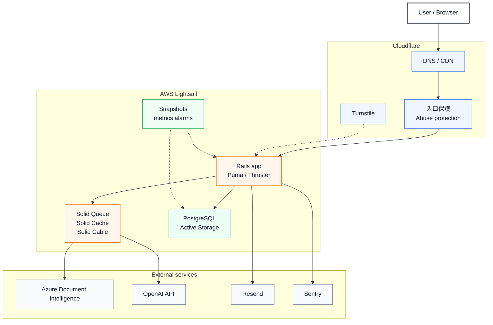

# Recify

Recifyは、レシート画像をアップロードし、OCR解析とAI補完によって店舗名・日付・金額・明細・カテゴリ整理を支援するレシート管理アプリです。

支出記録を、画像アップロード、解析、確認、編集、保存までの流れで扱えるようにすることを目指しています。

## URL

- URL: https://recify-app.com

## 主な機能

- レシート画像アップロード
- OCR解析による店舗名、日付、合計金額、明細候補の抽出
- AI補完によるカテゴリ分類や商品名整理の支援
- 明細、税区分、支払情報、合計金額の確認・編集
- 税率、割引、支払調整を含む金額整合性チェック
- レシート一覧、検索、詳細表示
- ゲスト利用と通常ユーザーへの本登録
- メール確認、パスワード再設定、アカウントロック解除
- パスキー、認証アプリ、リカバリーコードを使った認証強化
- ライト/ダークテーマ切替
- お知らせ、通知、問い合わせ
- 利用規約・プライバシーポリシーの同意管理

## 利用フロー

1. レシート画像をアップロードします。
2. OCRで店舗名、日付、金額、明細候補を抽出します。
3. 必要に応じてAI補完でカテゴリや商品名整理を支援します。
4. ユーザーが明細、税率、支払情報、調整額を確認・編集します。
5. 金額整合性を確認し、レシートとして保存します。

## 使用技術

### Application

- Ruby 4.0.5
- Ruby on Rails 8.1.3
- PostgreSQL
- Turbo / Stimulus
- Tailwind CSS
- Devise
- WebAuthn
- Active Storage
- Solid Queue / Solid Cache / Solid Cable
- RSpec

### OCR / AI / External Services

- Azure Document Intelligence
- OpenAI API
- Resend
- Sentry
- Cloudflare Turnstile

### Infrastructure / Operations

- AWS Lightsail
- Docker
- Kamal
- Cloudflare
- Abuse protection
- snapshots / metrics alarms

### Quality

- RuboCop
- ERB Lint
- StandardJS
- Stylelint
- gitleaks
- bundler-audit
- brakeman

## OCR / AI補完

Recifyの解析フローは、OCR、AI補完、保存判定を分けて扱います。

- OCRはAzure Document Intelligenceを利用し、レシート画像から候補値を抽出します。
- AI補完はOpenAI APIを利用し、カテゴリや商品名整理を支援します。
- OCR結果とAI結果をそのまま保存せず、金額整合性やレビュー判定を組み合わせます。
- AIが不確かな内容は、ユーザー確認が必要な状態として扱います。
- 外部サービス障害時は、認証エラー、利用制限、タイムアウト、解析失敗を分けて扱います。
- OCR/AI機能は実装済みで、運用設定により利用範囲や公開状態を制御できる設計です。
- 抽出結果は常に正しいものとして扱わず、必要に応じてユーザーが確認・修正する前提です。

## 金額計算 / 税率対応

OCRやAIの候補値を元に、アプリ側で金額の整合性を確認する方針にしています。

- 税込・税抜の金額を扱えるように整数円で正規化
- 8% / 10% など複数税率に対応
- 明細単位、税率単位、支払単位の情報を分けて保持
- 割引、ポイント利用、キャッシュレス還元などの支払調整に対応
- 丸め設定を考慮した合計金額の検算
- OCR/AI結果に矛盾がある場合は、保存前に確認が必要な状態として扱う

## セキュリティ・運用面の工夫

公開運用を想定し、認証、管理画面、ログ、監視、バックアップの基本を整えています。

- Deviseベースの認証
- メール確認、ロック、ログイン履歴管理
- Passkey / WebAuthn対応
- 認証アプリとリカバリーコードによる追加認証
- ゲスト利用から本登録への安全な導線
- 管理者向けの重要操作に対する追加確認
- Cloudflareを利用した公開前提の入口保護
- Turnstileによるbot対策
- Rails / Sentry / structured logでの認証情報の秘匿
- 外部API連携時の安全なメタデータ記録
- Sentryによるエラー監視
- DBと添付画像を対象にしたバックアップ・復旧確認
- Lightsail snapshotとメトリクス通知
- 法務文書の同期と同意履歴管理
- HSTSは公開後の安定状況を見て段階導入予定

## 管理画面

管理画面は通常ユーザー向け導線とは分離し、管理権限と保護されたアクセス経路を前提にしています。重要な管理操作では、操作理由や追加確認を組み合わせて安全性を高めています。

## 画面構成

- LP
- 認証画面
- レシート一覧
- レシート登録
- レシート詳細 / 編集
- 設定
- 通知
- 問い合わせ
- 法務ページ
- 管理者画面

## ER図

主要モデルだけを抜粋した簡易ER図です。読みやすいように、ドメインごとにグループ分けしています。

## インフラ構成

以下は、Recifyの本番運用で利用している主要サービスのインフラ構成図です。

## 今後の改善予定

- 統計ページの追加
  - グラフ表示
  - 月別・年別集計
  - カテゴリ別や購入内容ごとの割合表示
- S3 / R2など外部オブジェクトストレージへの移行
- OCR / AI精度改善
- レシート分類・検索体験の強化
- スマホアプリ向けAPIの実装
