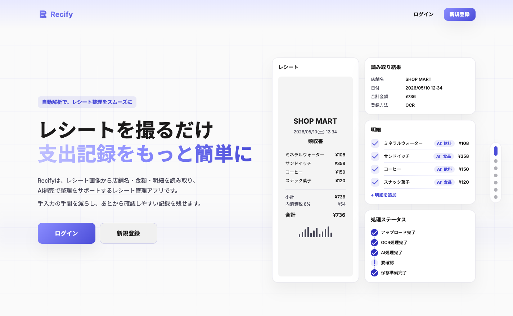
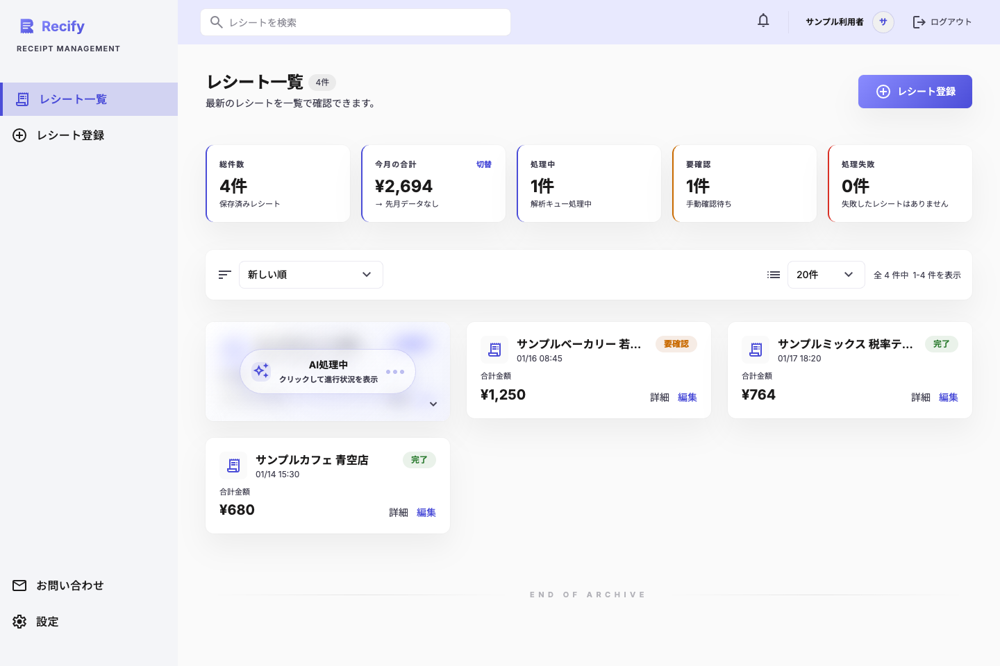
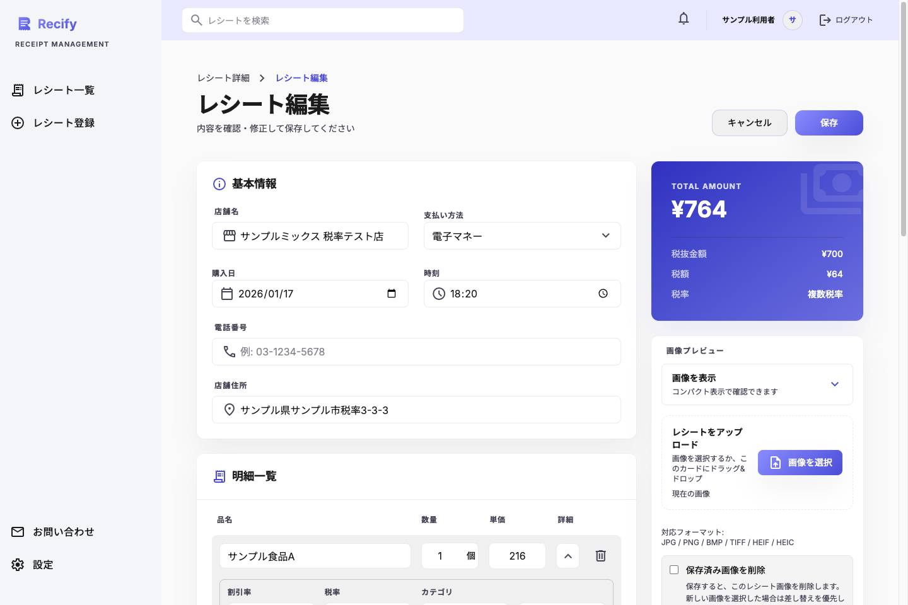
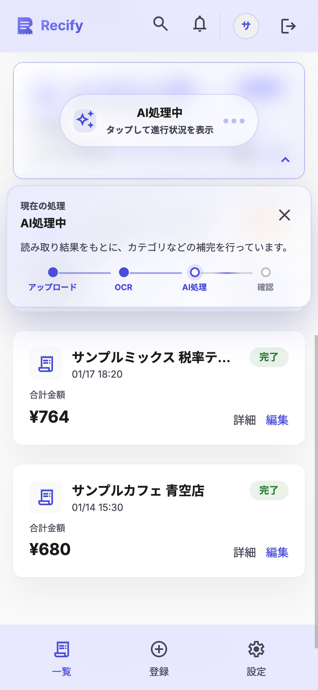
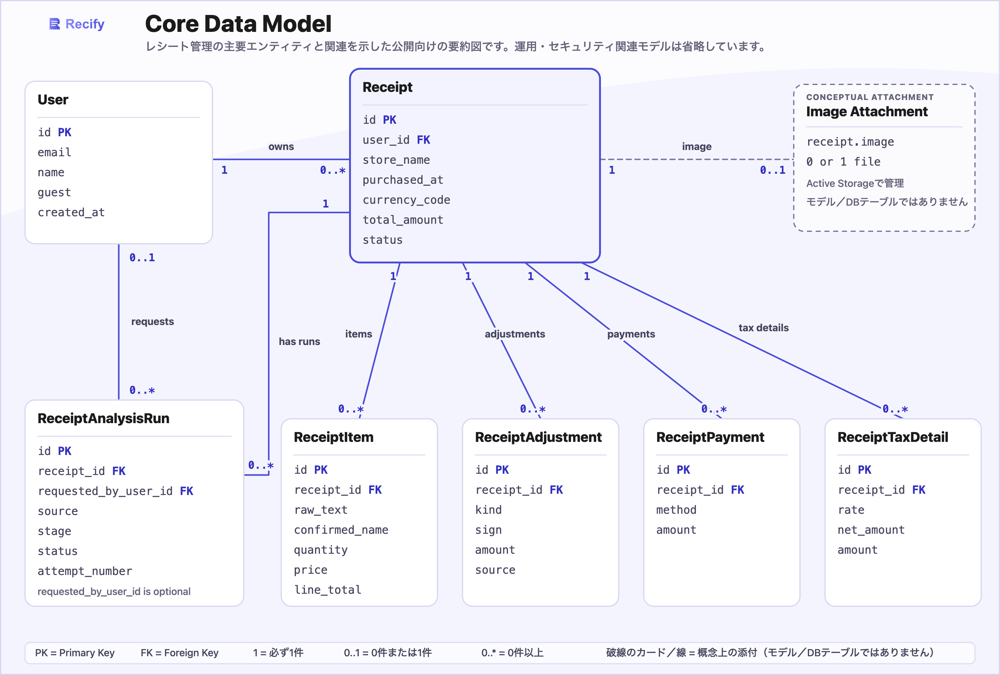
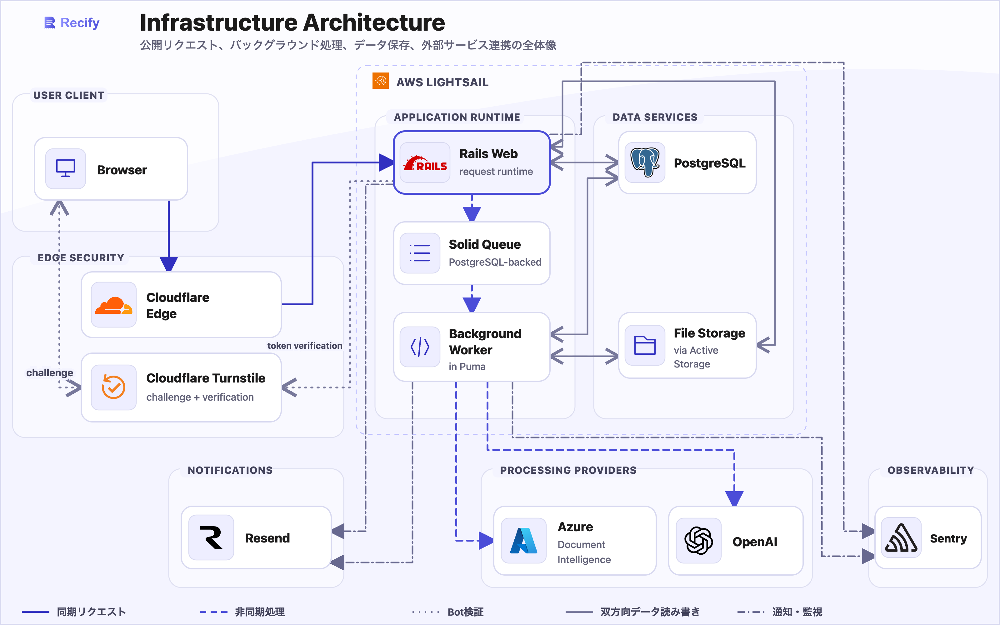

  

# Recify

> レシート整理を、もっと簡単に。

## Current release

**Current release: v1.2.3**

- Version: [`VERSION`](VERSION)
- Changelog: [`CHANGELOG.md`](CHANGELOG.md)
- Release notes: [`release_notes/v1.2.3.md`](release_notes/v1.2.3.md)
- Versioning policy: [`VERSIONING.md`](VERSIONING.md)
- Release tag: [`v1.2.3`](https://github.com/matsumoto219/Recify/tree/v1.2.3)

## プロダクト概要

Recifyは、レシート画像から店舗名・購入日時・金額・明細を読み取り、確認しやすい支出記録へ整理するRailsアプリです。

画像のアップロードから解析、内容確認、編集、保存、検索までをひとつの流れで扱い、手入力や紙のレシートを探す負担を減らします。AIによるカテゴリ整理を支援し、設定に応じて商品名候補を補完します。

OCRやAIの結果は入力補助です。抽出・補完された内容が常に正しいとは限らないため、利用者が確認し、必要に応じて修正することを前提としています。

## 試してみる

- 本番環境: [https://recify-app.com](https://recify-app.com)
- ログイン画面: [https://recify-app.com/users/sign_in](https://recify-app.com/users/sign_in)

ログイン画面で「ゲストとして試す」を選択すると、アカウント登録前に一部機能を体験できます。

ゲストアカウントとそのデータは一時的な体験用で、一定期間利用がない場合に削除されます。また、一部機能には制限があります。本番環境では、ゲスト利用であっても、個人情報や第三者の情報など機微な内容を含む実レシートをアップロードしないでください。

利用前に以下をご確認ください。

- [利用規約](https://recify-app.com/terms)
- [プライバシーポリシー](https://recify-app.com/privacy)
- [お問い合わせ](https://recify-app.com/contact)

<strong>目次</strong>

- [スクリーンショット](#スクリーンショット)
- [主な機能](#主な機能)
- [利用フロー](#利用フロー)
- [設計上の工夫](#設計上の工夫)
- [技術スタック](#技術スタック)
- [セキュリティ・プライバシー方針](#セキュリティプライバシー方針)
- [主要データ構成](#主要データ構成)
- [インフラ構成](#インフラ構成)
- [最新リリース](#最新リリース)
- [今後の改善候補](#今後の改善候補)
- [法務・ライセンス・脆弱性報告](#法務ライセンス脆弱性報告)

## スクリーンショット

以下の画像は、ローカル環境の匿名テストユーザーと架空データを使用しています。実ユーザー、実レシート、メールアドレス、IPアドレス、解析の生データは含みません。

### ランディングページ

### レシート一覧と処理状態

### レシート編集と金額確認

### モバイル表示

  

## 主な機能

- レシート画像のアップロードと手動入力
- 複数のレシート画像を選択できる一括アップロード
- OCRによる店舗名、購入日時、金額、明細候補の抽出
- AIによるカテゴリ整理と、設定に応じた商品名候補の補完
- バックグラウンド解析と画面上での処理状態更新
- 明細、数量、税率、割引、支払情報、調整額の確認・編集
- 複数税率や支払調整を含む金額整合性の確認
- レシート一覧、検索、詳細表示
- ゲスト利用から本登録への移行
- メール確認、パスワード再設定、アカウントロック解除
- パスキー、認証アプリ、リカバリーコードによる認証強化
- ライトテーマとダークテーマ
- お知らせ、通知、お問い合わせ
- 利用規約・プライバシーポリシーの表示と同意管理

## 利用フロー

1. レシート画像をアップロードするか、内容を手動で入力します。
2. アップロードした画像をバックグラウンドでOCR解析します。
3. AIが利用可能な場合は、カテゴリ整理などの補完を行います。
4. 店舗名、購入日時、明細、税率、支払情報、合計金額を確認し、必要に応じて編集・保存します。
5. 保存した記録を一覧や検索から見返します。

AIを利用できない場合でも、OCR結果をもとに確認・編集へ進めるようにしています。外部サービスの状態や解析結果によっては、利用者による確認が必要な状態になります。

## 設計上の工夫

- OCRの抽出候補、AIの補完候補、利用者が確定した値を分けて扱います。
- 金額は整数円を基本とし、複数税率、割引、追加料金、支払調整、丸めを考慮して検算します。
- 画像解析をバックグラウンドで行い、処理状態を画面へ反映します。
- AI連携に問題がある場合も、OCR結果を利用した確認フローを維持します。
- 不確かな値を自動確定せず、確認が必要な項目として利用者へ示します。
- レスポンシブ表示、ライト／ダークテーマ、動きを抑える表示設定に対応します。
- 認証、レシート処理、金額計算、外部連携の責務と依存方向を分け、回帰テストで境界を確認します。

## 技術スタック

### アプリケーション

| 技術 | 用途 |
| --- | --- |
| Ruby 4.0.5 | アプリケーション実行環境 |
| Ruby on Rails 8.1.3.1 | Webアプリケーションフレームワーク |
| PostgreSQL | ユーザーとレシート関連データの保存 |
| Turbo / Stimulus | 画面遷移、フォーム操作、処理状態の更新 |
| Tailwind CSS | UIスタイリング |
| Devise | ユーザー認証、メール確認、パスワード再設定 |
| WebAuthn / ROTP | パスキーと認証アプリによる追加認証 |
| Active Storage / ruby-vips | レシート画像の添付と画像処理 |
| Solid Queue / Solid Cache / Solid Cable | 非同期ジョブ、キャッシュ、リアルタイム更新 |

### OCR・AI・外部サービス

| 技術 | 用途 |
| --- | --- |
| Azure Document Intelligence | レシート画像から店舗名、日時、金額、明細候補を抽出 |
| OpenAI API | カテゴリ整理などのAI補完 |
| Cloudflare Edge | CDNと公開経路の保護 |
| Cloudflare Turnstile | ボット検証 |
| Resend | 認証・通知・問い合わせ関連メールの送信 |
| Sentry | エラー監視 |

### インフラ・開発

| 技術 | 用途 |
| --- | --- |
| AWS Lightsail | アプリケーション実行基盤 |
| Docker / Kamal | コンテナ化とデプロイ |
| RSpec | モデル、リクエスト、サービス、ジョブ、システムテスト |
| RuboCop / StandardJS / Stylelint | Ruby、JavaScript、CSSの静的確認 |
| Brakeman / Bundler Audit / Importmap Audit | アプリケーションと依存関係のセキュリティ確認 |

## セキュリティ・プライバシー方針

- パスキー、認証アプリ、リカバリーコードに対応します。
- メール確認、アカウントロック、重要操作時の本人再確認を行います。
- レート制限とボット対策により、不正利用や過度なアクセスを抑制します。
- アップロード画像の形式、容量、画像としての妥当性を検証します。
- 通常利用者向け機能と管理機能の権限を分離します。
- 重要な操作を監査できる記録を残します。
- ログやエラー監視へ認証情報や機微情報が残りにくいよう、削減とマスキングを行います。
- CIでテスト、Lint、静的解析、依存関係のセキュリティ確認を実行します。

画像解析では、レシート画像がOCRサービスへ送信される場合があります。AI補完では、原則としてOCRで抽出したテキストや解析に必要な構造化情報を利用します。詳しくは[プライバシーポリシー](https://recify-app.com/privacy)をご確認ください。

## 主要データ構成

公開機能を説明するため、レシート管理に関係する主要モデルと関連だけを、現行のモデル関連とデータベーススキーマに基づいて示しています。この図は概念理解を目的としており、物理的なデータベース構造やその互換性を保証するものではありません。

画像を選択すると原寸で確認できます。

レシート画像は独立した`ReceiptImage`モデルやテーブルではなく、`Receipt`の任意のActive Storage添付として管理します。認証・監査・運用管理用の内部モデルは、この公開向け図から省略しています。

## インフラ構成

ブラウザからRailsアプリケーション、バックグラウンド処理、データ保存、外部OCR／AI、メール、エラー監視までの関係を高レベルに示します。公開理解のための概念図であり、実際のネットワークトポロジーや運用上の境界を示すものではありません。

画像を選択すると原寸で確認できます。

## 最新リリース

### v1.2.3

v1.2.3では、新しい利用者向け機能を追加せず、Active Storageの画像処理に関するセキュリティ更新を適用しました。

v1.2.2からv1.2.3への新しいデータベースマイグレーションはありません。

主な変更は[`CHANGELOG.md`](CHANGELOG.md)と[`release_notes/v1.2.3.md`](release_notes/v1.2.3.md)をご覧ください。

## 今後の改善候補

以下は将来の検討事項であり、提供時期を確約するものではありません。

- 月別・年別・カテゴリ別の集計とグラフ表示
- レシート検索・分類体験の改善
- OCR／AI補完精度の改善
- 画像ストレージ構成の拡張
- モバイルアプリ向けAPI
- 公開ライセンスの明確化と、脆弱性報告専用窓口の整備

## 法務・ライセンス・問題の報告

- [利用規約](https://recify-app.com/terms)
- [プライバシーポリシー](https://recify-app.com/privacy)
- [お問い合わせ](https://recify-app.com/contact)

Recifyはレシート管理を補助するサービスであり、税務、会計、法律上の専門的助言を提供するものではありません。

現時点では、ソースコードの利用条件を示す`LICENSE`ファイルを配置していません。オープンソースライセンスが適用されるものとして取り扱わないでください。

不具合、予期しない動作、脆弱性を含むセキュリティ上の問題に関するご連絡は、お問い合わせフォームからお願いします。報告には、認証情報、個人情報、外部サービスの秘密情報を含めないでください。
